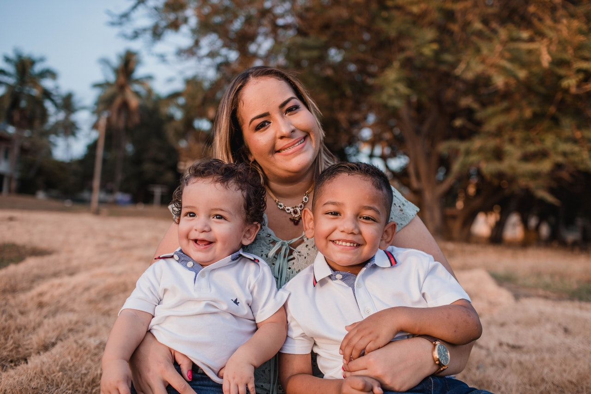

# age-gender-prediction-opencv
# Age & Gender Prediction using OpenCV and DNN

🚀 A computer vision project that detects human faces from webcam and predicts the **gender** and **age group** using pre-trained deep learning models.

## 🔧 Technologies Used
- Python 3.x
- OpenCV (cv2)
- Deep Neural Networks (OpenCV DNN module)
- Pre-trained models from Caffe

## 📦 Requirements

```bash
pip install -r requirements.txt
```
---
# 👤 Age & Gender Prediction using OpenCV DNN

A real-time computer vision application that detects human faces from a webcam or video feed and predicts the **age group** and **gender** using pre-trained deep learning models.



---

## 🧠 Project Features

✅ Real-time **face detection**  
✅ Predicts **age group** (e.g., 10-20, 20-30)  
✅ Predicts **gender** (Male / Female)  
✅ Uses lightweight pre-trained **Caffe models**  
✅ Can work with **webcam or video file input**

---

## 🛠️ Technologies Used

- Python 3.9+
- OpenCV (with DNN module)
- Pre-trained Deep Learning Models (Caffe)
- NumPy

---

## 📦 Installation

### 1. Clone the Repository

```bash
git clone https://github.com/your-username/age-gender-prediction-opencv.git
cd age-gender-prediction-opencv
```
### 2. Create Virtual Environment (Optional but Recommended)

```bash
python -m venv faceenv
faceenv\Scripts\activate     # On Windows
# source faceenv/bin/activate  # On Linux/macOS
```
### 3. Install Requirements
```bash
pip install -r requirements.txt
```
## requirements.txt:
```bash
opencv-python
numpy
```
### Output Example
## The model will display:

Green box around faces
Predicted Gender and Age Group (e.g., "Male, 20-30")

### Applications
📌Smart Mirrors and Kiosks
📌Audience Demographics Analysis
📌Marketing and Targeted Ads
📌Security & Surveillance Insights

### 💡 Future Improvements
>Optimize with TensorFlow Lite or ONNX
>Add emotion detection
>Web interface with Flask or Streamlit

### 📂 Credits
>Pre-trained models from LearnOpenCV by Satya Mallick
>Face detection based on OpenCV's DNN module
